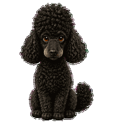

# Lando — Codex Pet

Lando is a custom animated Codex pet based on a black poodle with a curly topknot, floppy ears, warm brown eyes, and a lightly silvered muzzle.

## Install

1. Download [the pet package](outputs/lando-pet.zip).
2. Extract it and copy the `lando` folder into your Codex pets directory:
   - Windows: `%USERPROFILE%\\.codex\\pets\\lando`
3. In Codex, open **Settings → Pets**, choose **Refresh**, select **Lando**, then enter `/pet` to wake him.

## Included files

- `outputs/lando/` — the installable v2 pet (`pet.json` and `spritesheet.webp`)
- `outputs/lando-pet.zip` — ready-to-download installation package
- `outputs/lando-preview.html` — an interactive local animation preview
- `outputs/lando-animations.png` — animation contact sheet
- `outputs/lando-creation-notes.md` — source, art direction, and animation notes
- `outputs/lando-validation.json` — final visual validation results

## Pet format

Lando uses Codex pet sprite format v2: a transparent 8 × 11 spritesheet with nine animation rows and sixteen look directions. It includes idle, running, waving, jumping, failed, waiting, working, and reviewing states.

## Personal project

Lando’s likeness, reference photos, and resulting character artwork are personal to the project owner. No license is granted for reuse, redistribution, or commercial use without permission.
